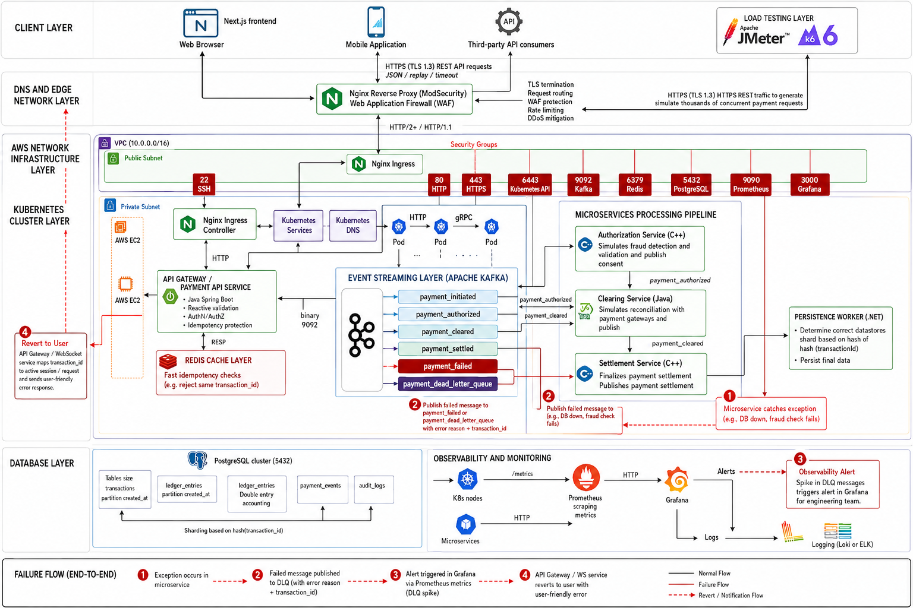
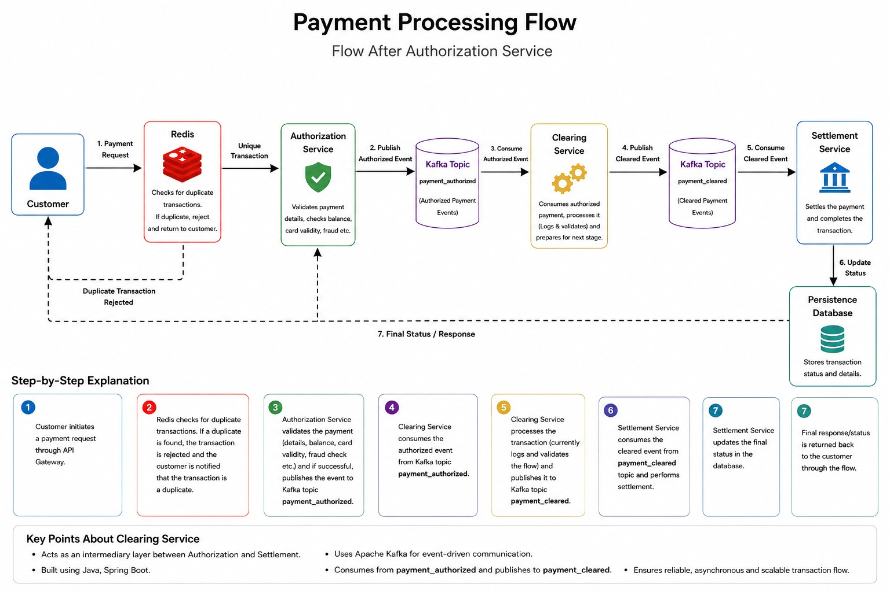

# Payment Gateway and Payment Processor 

[](https://github.com/tricko98/hpe-payment-gateway/actions)
[](https://kubernetes.io/)
[](https://kafka.apache.org/)
[](https://www.postgresql.org/)

> A highly scalable, distributed, event-driven payment processing system built as an HPE academic/engineering project. It simulates a production-grade payment gateway capable of processing up to 10,000 requests per second.

---

##  Table of Contents

- [Overview](#-overview)
- [Architecture & Flow](#-architecture--flow)
- [Infrastructure Stack](#-infrastructure-stack)
- [Microservices Ecosystem](#-microservices-ecosystem)
- [Database Architecture](#-database-architecture)
- [Getting Started](#-getting-started)
- [Performance & Benchmarks](#-performance--benchmarks)
- [Team](#-team)

---

## 🌟 Overview

The **Payment Gateway and Payment Processor** is designed to replace traditional cloud-managed services with a robust, self-hosted Kubernetes ecosystem. It demonstrates how to build a highly available, event-driven financial transaction system from the ground up, utilizing best practices in distributed systems, idempotency, sharding, and double-entry accounting.

**Key Design Philosophy:**
Replace managed services (like AWS ALB, MSK, RDS, ElastiCache) with self-hosted robust alternatives running on Kubernetes (Nginx, Kafka, PostgreSQL Sharded, Redis).

---

##  Architecture & Flow

### High-Level Design (HLD)


### Low-Level Design (LLD)


The system processes payments asynchronously using an event-driven architecture powered by **Apache Kafka**.

```text
POST /api/v1/payments
      │
      ▼
[API Gateway] ──(Idempotency Check)──> Redis
      │
      ▼
[Kafka Topic: payment_initiated]
      │
      ▼
[Authorization Service (C++)] ──> Validates Funds
      │
      ▼ (PASS)
[Kafka Topic: payment_authorized]
      │
      ▼
[Clearing Service (Java)]
      │
      ▼
[Kafka Topic: payment_cleared]
      │
      ▼
[Settlement Service (C++)]
      │
      ▼
[Kafka Topic: payment_settled]
      │
      ▼
[Persistence Worker (Java)] ──> Writes to PostgreSQL (Sharded)
```

---

##  Infrastructure Stack

We embrace a fully self-managed stack on Kubernetes:

| Component | Technology | Purpose |
| :--- | :--- | :--- |
| **Edge Security** | Nginx + ModSecurity | WAF & Rate Limiting |
| **Ingress/Routing** | Kubernetes Ingress | Traffic management |
| **API Layer** | Spring Boot | Entrypoint API (NodePort 30080) |
| **Caching** | Redis | Idempotency & temporary state |
| **Event Bus** | Apache Kafka | Async microservice communication |
| **Database** | PostgreSQL | 3-node Sharded Cluster |
| **Compute** | AWS EC2 (c6i.2xlarge) | Raw infrastructure |
| **Monitoring** | Prometheus + Grafana | System observability |

---

## 🧩 Microservices Ecosystem

The architecture is composed of specialized microservices developed in Java and C++:

1. **API Gateway (`Java/Spring Boot`)**: The front door. Handles REST APIs, idempotency via Redis, and publishes initial events to Kafka.
2. **Authorization Service (`C++`)**: High-performance validation engine. Validates intents, user existence, and fraud rules.
3. **Clearing Service (`Java/Spring Boot`)**: Clears authorized payments.
4. **Settlement Service (`C++`)**: Settles payments, preparing them for final database persistence.
5. **Persistence Worker (`Java/Spring Boot`)**: Responsible for writing financial records (transactions, ledgers, events) to a sharded PostgreSQL cluster using consistent hashing.

---

##  Database Architecture

The persistence layer relies on a **sharded PostgreSQL cluster** (3 shards: `shard-0`, `shard-1`, `shard-2`) for horizontal scalability.

- **Sharding Strategy:** Consistent hashing on `transaction_id`.
- **Partitioning:** The `transactions` table is range-partitioned by `created_at` (monthly) to ensure high query performance over time.
- **Double-Entry Ledger:** `ledger_entries` table strictly adheres to double-entry accounting (Total Debits = Total Credits).

---

##  Getting Started

### Prerequisites
- Kubernetes cluster (or Minikube/kind for local development)
- `kubectl` and `helm` installed
- Docker

### Deployment
1. **Clone the repository:**
   ```bash
   git clone https://github.com/tricko98/hpe-payment-gateway.git
   cd hpe-payment-gateway
   ```

2. **Deploy Infrastructure Services:**
   Deploy Kafka, Redis, and PostgreSQL shards located in `infrastructure/kubernetes/`:
   ```bash
   kubectl apply -f infrastructure/kubernetes/kafka/
   kubectl apply -f infrastructure/kubernetes/redis/
   kubectl apply -f infrastructure/kubernetes/postgres/
   ```

3. **Deploy Microservices:**
   ```bash
   kubectl apply -f infrastructure/kubernetes/services/
   ```

4. **Apply Autoscaling (HPA):**
   ```bash
   kubectl apply -f infrastructure/kubernetes/autoscaling/
   ```

---

##  Performance & Benchmarks

The system is rigorously load-tested using **JMeter** and **k6** to handle massive traffic spikes (e.g., Black Friday sales).

- **Target Throughput:** 10,000 RPS (Requests Per Second)
- **API Gateway Threads:** 800 (Tomcat Max)
- **Kafka Batch Size:** 32,768 bytes with `linger.ms=10`
- **Autoscaling:** Dynamic HPA scaling up to 80 pods for API Gateway, stabilizing under 120s.

---

## 👥 Team

| Member | Focus Area | Technologies |
| :--- | :--- | :--- |
| **Roshan Laharwani** | Architecture, Deployment, Frontend & Monitoring | Kubernetes, Prometheus, Grafana, React |
| **Avipsa Mukherjee** | API Gateway | Java, Spring Boot, Redis, Kafka |
| **Kumaresh Ramachandran**| Authorization Service | C++, librdkafka, libpqxx |
| **M. Laasya** | Clearing Service | Java, Spring Boot |
| **Ram** | Settlement & Persistence | C++, Java, PostgreSQL Sharding |

---
